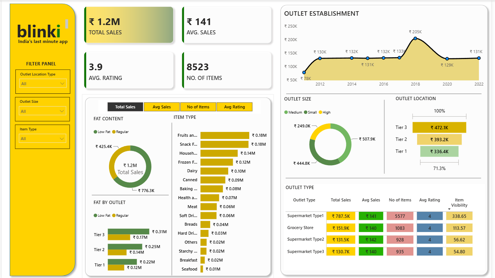
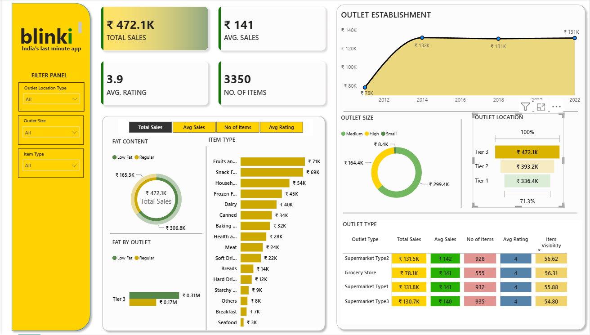
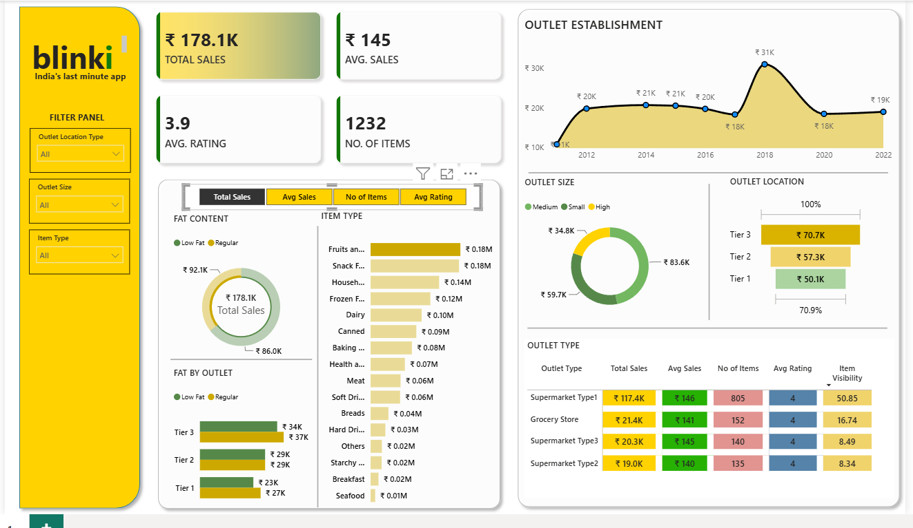
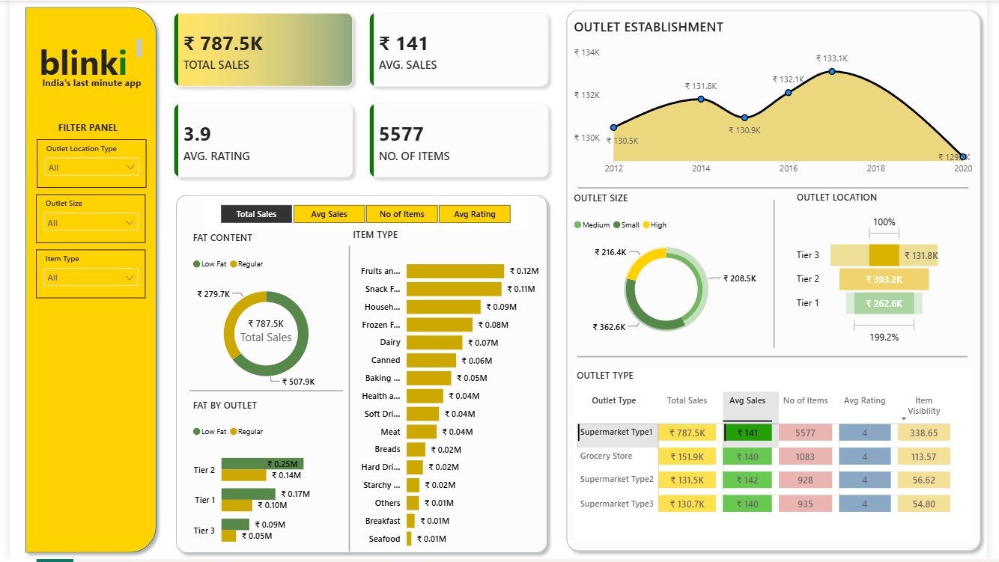
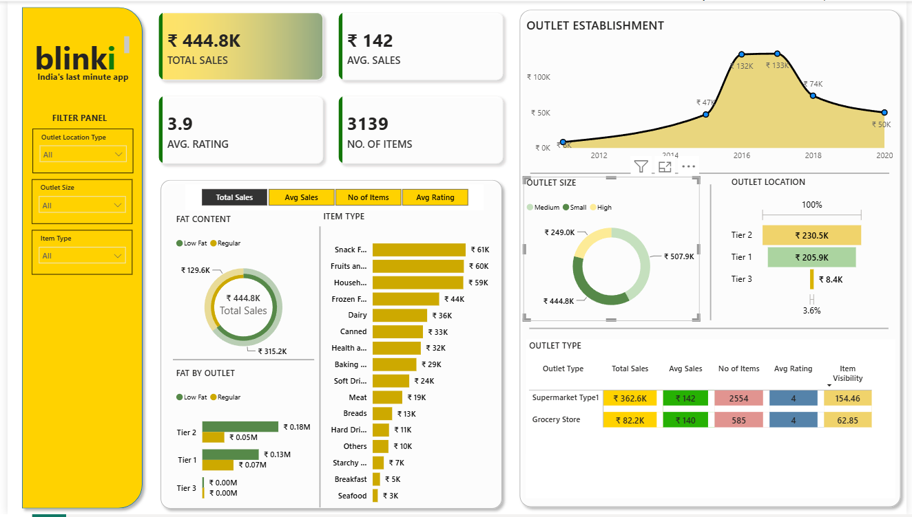

# Blinkit Sales & Data Analytics

An end-to-end data analytics project using **MySQL, Python, Power BI, and Excel** to analyze Blinkit's grocery sales data and identify meaningful business insights.

---

## 📌 Project Overview

This project analyzes Blinkit's grocery sales data to understand sales performance across different products, outlet types, outlet sizes, locations, and other business dimensions.

The project follows an end-to-end data analytics workflow:

**Raw Data → Data Cleaning → SQL Analysis → Python EDA → Power BI Dashboard → Business Insights**

The analysis focuses on key business metrics including total sales, average sales, number of items, customer ratings, product categories, outlet performance, fat content, outlet size, outlet location, and establishment year.

---

## 🎯 Business Objectives

The main objectives of this project are:

* Analyze overall sales performance.
* Calculate important business KPIs.
* Identify high-performing product categories.
* Analyze sales based on item fat content.
* Compare sales across different outlet types.
* Analyze the relationship between outlet size and sales.
* Compare sales across different outlet locations.
* Analyze outlet establishment trends.
* Examine customer ratings.
* Generate actionable business insights from the data.

---

## 📊 Dataset

The dataset contains **8,523 records** and **12 columns** describing grocery products and their corresponding outlets.

### Important Columns

| Column                      | Description                             |
| --------------------------- | --------------------------------------- |
| `Item_Identifier`           | Unique identifier for each product      |
| `Item_Fat_Content`          | Fat-content category of the product     |
| `Item_Type`                 | Product category                        |
| `Item_Weight`               | Weight of the product                   |
| `Item_Visibility`           | Visibility of the product in the outlet |
| `Total_Sales`               | Sales generated by the product          |
| `Rating`                    | Customer rating                         |
| `Outlet_Identifier`         | Unique identifier for the outlet        |
| `Outlet_Size`               | Size of the outlet                      |
| `Outlet_Location_Type`      | Location tier of the outlet             |
| `Outlet_Type`               | Type of outlet                          |
| `Outlet_Establishment_Year` | Year the outlet was established         |

---

# 📈 Key Performance Indicators

The analysis produced the following overall KPIs:

| KPI                   |         Value |
| --------------------- | ------------: |
| **Total Sales**       | ₹1,201,681.48 |
| **Average Sales**     |          ₹141 |
| **Number of Records** |         8,523 |
| **Average Rating**    |          3.97 |

These KPIs provide a high-level overview of the sales performance represented in the dataset.

---

# 📊 Power BI Dashboard

An interactive Power BI dashboard was created to visualize the major KPIs and sales patterns identified during the analysis.

### Dashboard Preview

### Power BI File

[Open the Power BI Dashboard](powerbi/blinkit-dashboard.pbix)

---
